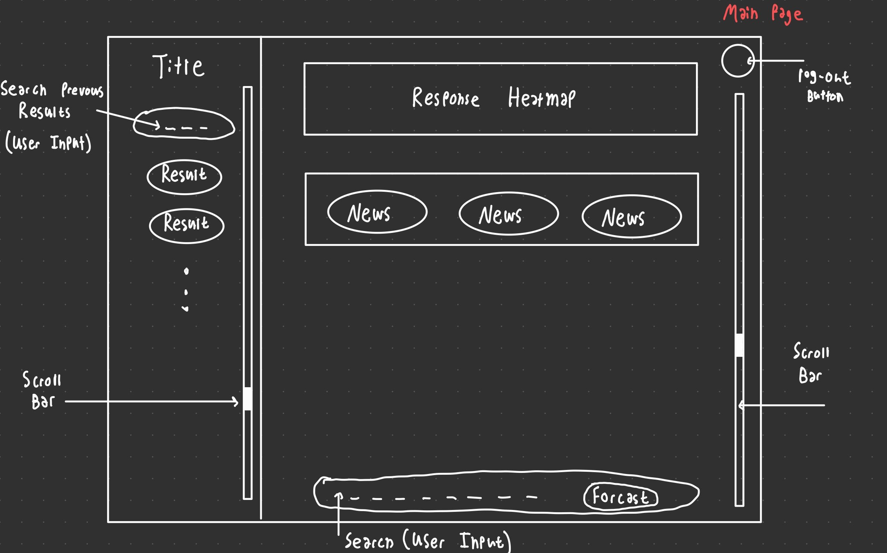
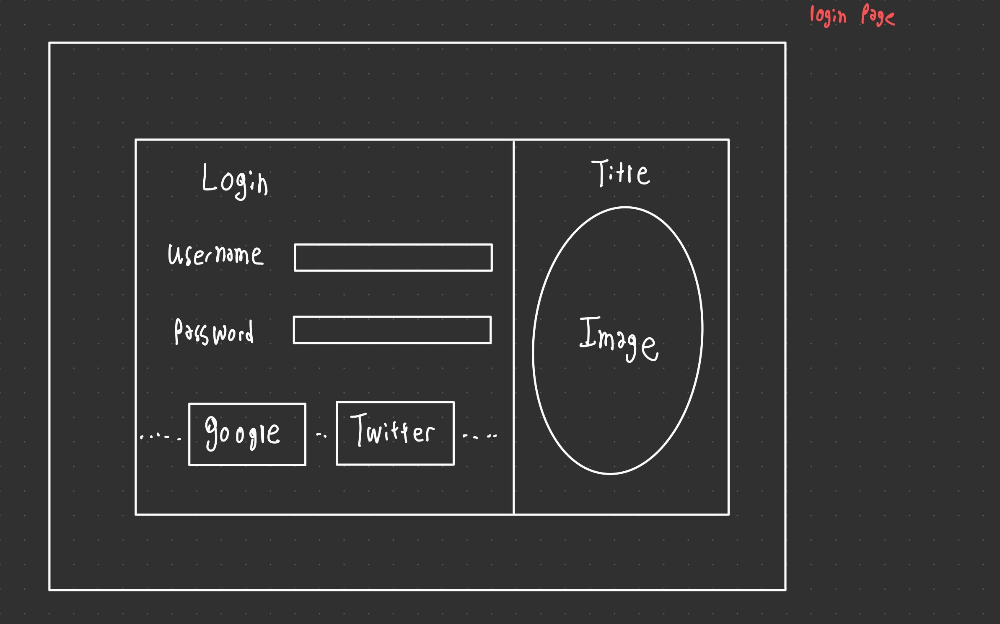
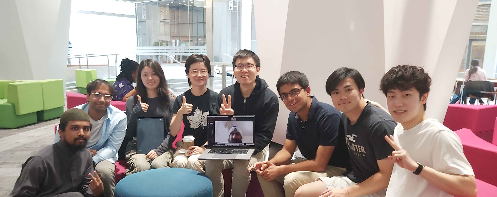

# ForecastAI/HeavyLifters
> _Note:_ This document will evolve throughout your project. You commit regularly to this file while working on the project (especially edits/additions/deletions to the _Highlights_ section). 
 > **This document will serve as a master plan between your team, your partner and your TA.**

## Product Details
 
#### Q1: What is the product?

* **<u>Mockup Design</u>**

  Below is a rough website design created by Tyseer, which illustrates the user interface and flow of the platform. This mockup serves as a foundation for the development process, guiding the design of core pages and interactions.
  
  

#### Q2: Who are your target users?

Our target users are advanced researchers and engineers from various organizations. This includes key members of the Machine Learning Group at UofT, along with members from external organizations engaged in AI, NLP, and AI forecasting research. These users possess strong technical skills and are engaged in cutting-edge research and practical applications in their fields.

#### Q3: Why would your users choose your product? What are they using today to solve their problem/need?

  Current solutions, such as those used by FiveThirtyEight, are limited in their interactivity and do not allow for a granular view of the data and bias within the text. Our product changes this by providing visualizations that allow users to not only see where bias exists but also control the extent of bias they want to examine.

  This saves users time by streamlining the process of bias analysis, which would otherwise require manual/less precise tools.

#### Q4: What are the user stories that make up the Minumum Viable Product (MVP)?

1. As a forecast researcher, I want to be able to view all my chat messages with the AI agent so that I can go back and use it as reference material for future work. 
    - Acceptance Criteria:
    The user should be able to search for their past chats by typing into a search bar.

2. As a forecast researcher, I want to be able to see the 10 most relevant data related to the forecasting question that I have inputted so that I can view all the related sources that feed to the AI forecasting model. Users can control the parameters of how much data is needed.
    - Acceptance Criteria:
      1. The system must allow users to input a specific forecasting question.
      2. The system must retrieve and display the 10 most relevant data points related to the forecasting question inputted by the user.
      3. Users should be able to view the entire content of each data source to understand its context.

  3. As a forecast researcher, I want to be able to see the quantified reasoning and bias of the data sources when the relevant query is given in a visually appealing manner in order to save time by streamlining the data exploration.

#### Q5: Have you decided on how you will build it? Share what you know now or tell us the options you are considering.

 It will be a full-stack web application where TypeScript, React will be used in building the frontend for user input, displaying visualizations, and handling user interactions while Python, FastAPI will be used in building the backend to handle requests from the front-end, manage data processing, and integrate with external APIs to collect news and social media data. We will also be using Firebase for the database to store user accounts, user inputs, collected data, and metadata, along with Python to perform data processing tasks like sentiment analysis, stakeholder identification, and structuring data into JSON objects. At last, we will also need to build a separate RESTful API using Python, FastAPI to provide endpoints for querying collected and processed data for AI models and other systems. We are planning to deploy the application through Netlify. We will be using Google Search API and OpenAI API to search for all the relevant data related to the forecasting question and rank the 10 most relevant ones.

----
## Intellectual Property Confidentiality Agreement 
> Note this section is **not marked** but must be completed briefly if you have a partner. If you have any questions, please ask on Piazza.
>  
**By default, you own any work that you do as part of your coursework.** However, some partners may want you to keep the project confidential after the course is complete. As part of your first deliverable, you should discuss and agree upon an option with your partner. Examples include:
1. You can share the software and the code freely with anyone with or without a license, regardless of domain, for any use.
2. You can upload the code to GitHub or other similar publicly available domains.
3. You will only share the code under an open-source license with the partner but agree to not distribute it in any way to any other entity or individual. 
4. You will share the code under an open-source license and distribute it as you wish but only the partner can access the system deployed during the course.
5. You will only reference the work you did in your resume, interviews, etc. You agree to not share the code or software in any capacity with anyone unless your partner has agreed to it.

**Your partner cannot ask you to sign any legal agreements or documents pertaining to non-disclosure, confidentiality, IP ownership, etc.**

Briefly describe which option you have agreed to.

----

## Teamwork Details

#### Q6: Have you met with your team?

#### Q7: What are the roles & responsibilities on the team?

#### Q8: How will you work as a team?

  * **<u>Weekly Team Meetings</u>**
    
    * **When**: Every Saturday 4pm
    * **Where**: Online via Discord Meetings
    * **Purpose**: To summarize the week's work, discuss progress, and identify any roadblocks. We will use this meeting to ensure alignment and plan for the upcoming week.
  
  * **<u>Partner Meetings</u>**
    * **When**: Every Friday 4pm
    * **Where**: Online
    * **Purpose**: To maintain alignment with our project partner, clarify any requirements, and review key deliverables before submission.

  * **<u>Urgent/Quick Meetings</u>**
    * **When**: Ad hoc, as needed for quick decisions or urgent matters
    * **Where**: Discord, our main communication channel for real-time discussions
    * **Purpose**: To resolve time-sensitive issues swiftly, ensuring quick coordination and decision making for in-depth questions

  We will take meeting notes using Google docs.

  
#### Q9: How will you organize your team?

  We will use **Jira**, to manage our To-Do lists, track tasks, and set deadlines.

  * **<u>Tracking Work</u>**: Jira will serve as our central hub, where all tasks are listed and tracked. Both our TA and partner will have access to the system to monitor progress in real time.

  * **<u>Prioritizing Tasks</u>**: We will assign priorities based on the project’s timeline and critical milestones. Tasks that are critical to overall goals and are emphasized by the partners in the meetings will be marked as high priority, and we will use Jira’s backlog and sprint planning features to organize these tasks accordingly.

  * **<u>Task Assignment</u>**: Tasks will be assigned to members based on their expertise, current workload, and preference. We will use Jira’s assignment feature to ensure clarity on who is responsible for each task. Members can self-assign tasks if they align with their strengths but need to notify the team in this case.

#### Q10: What are the rules regarding how your team works?

**Communications:**
 * What is the expected frequency? What methods/channels will be used? 
 * If you have a partner project, what is your process for communicating with your partner?
 
**Collaboration: (Share your responses to Q8 & Q9 from A1)**
 * How are people held accountable for attending meetings, completing action items? Is there a moderator or process?
 
 * How will you address the issue if one person doesn't contribute or is not responsive?

  If a team member doesn't contribute or is unresponsive, the team manager will first have a one-on-one conversation to understand why the deadline wasn't met and offer support if needed. If the issue persists, the team will collectively address it with the member to resolve the situation quickly. Should the problem continue, we will escalate the matter to the TA to seek further assistance in resolving the issue.

## Organisation Details

#### Q11. How does your team fit within the overall team organisation of the partner?

#### Q12. How does your project fit within the overall product from the partner?

## Potential Risks

#### Q13. What are some potential risks to your project?

* Uncertainty regarding visuals. We have a good idea on what the partner wants and were given reference code, but there are specifics we are not sure about like what would be appropriate to display to the user interacting with the bot . 

#### Q14. What are some potential mitigation strategies for the risks you identified?

- Communicate regularly with our partner to clarify any uncertainty and project-specific technical requirements through weekly meetings and daily conversation in discord.

