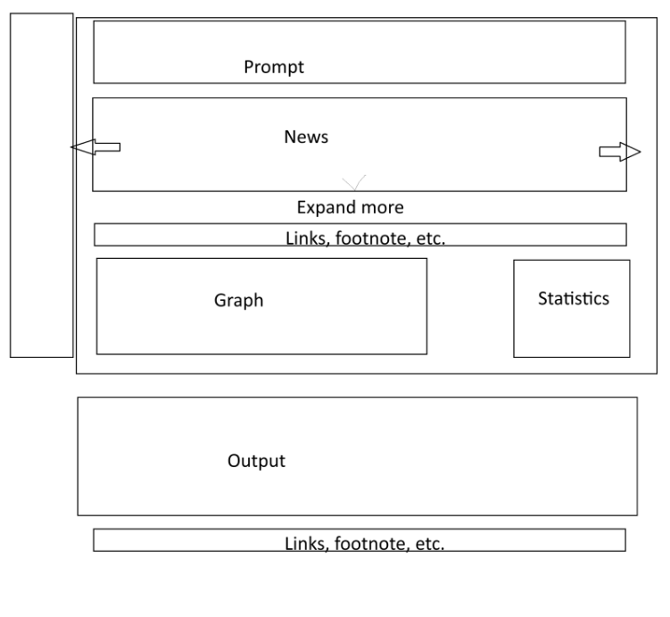
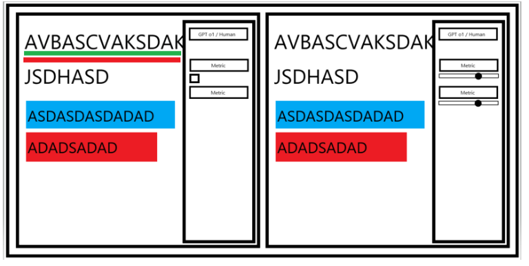
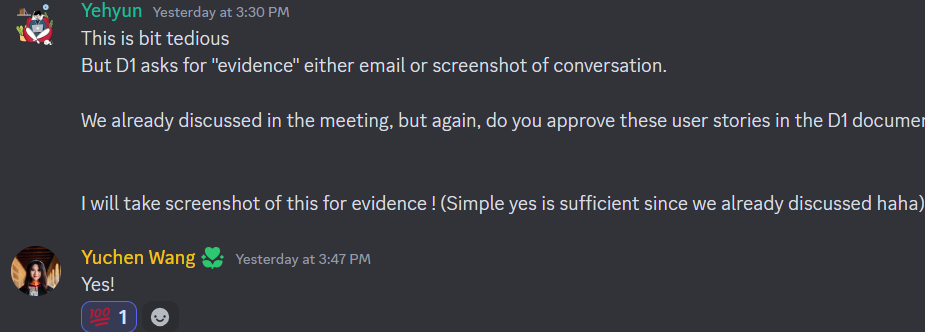

# ForecastAI/HeavyLifters
> _Note:_ This document will evolve throughout your project. You commit regularly to this file while working on the project (especially edits/additions/deletions to the _Highlights_ section). 
 > **This document will serve as a master plan between your team, your partner and your TA.**

## Product Details
 
#### Q1: What is the product?

The project is a software platform designed to enhance an AI agent's ability to forecast significant future events by gathering global data and visualizing the AI's reasoning and cognitive biases.

A key aspect of AI research is collecting vast, up-to-date, and relevant data to train models effectively. This project aims to streamline that process while providing researchers with valuable feedback by highlighting biases in the model's predictions. Additionally, the platform allows researchers to share their findings via link sharing for collaborative analysis.

The Machine Learning Group at the University of Toronto's Department of Computer Science has developed a language model (LLM) for forecasting significant future events. Our role is to visualize the model's outputs in an intuitive and shareable way, enabling both researchers and general users to easily interpret the results. This visualization will help users understand where bias occurs and how it affects the predictions, ultimately improving the accuracy and reliability of AI forecasting systems by reducing bias and ensuring decisions are based on factual evidence.

For example, users can ask the platform questions such as "Will Kamala Harris win the 2024 election?" The system will then gather relevant global data, validate it, and use it to generate AI forecasts. The results will be displayed in a way that highlights the AI's reasoning, allowing users to spot any cognitive biases.

In terms of bias detection, we are partnering with a custom-trained AI model to identify and quantify biases in the data. These biases are visualized using color coding: darker colors indicate more bias, softer colors like green indicate less bias, and no color indicates no bias at all.

Information about the team overlooking us:

Project team leads:
- Research Lead: Sheldon Huang (PhD Student at UToronto): https://www.cs.toronto.edu/~huang/
- Data Lead: Ezra Karger (Federal Reserve Bank, UChicago, Research Director of Forecasting Research Institute) https://ezrakarger.com/
- Software Lead: Yuchen Wang (Utoronto, Stanford, Microsoft) https://www.yuchenwyc.com/
- Advisor: Prof. Roger Grosse (CS Prof at UToronto, Scientist at Anthropic): https://www.cs.toronto.edu/~rgrosse/

**<u>Mockup Design</u>**

  Below is a rough website design created by Tyseer, which illustrates the user interface and flow of the platform. This mockup serves as a foundation for the development process, guiding the design of core pages and interactions.
  
  

  Below is another rouch design made by Yehyun approved by the partner.
  

  Below represent how the heatmap will visualize the bias and dropdown for selecting metrics.
  *This was made by Yehyun before meeting the partner, but this gives rough idea on what the heatmap will look.
  

#### Q2: Who are your target users?

Our target users are advanced researchers and engineers from various organizations. This includes key members of the Machine Learning Group at UofT, along with members from external organizations engaged in AI, NLP, and AI forecasting research. These users possess strong technical skills and are engaged in cutting-edge research and practical applications in their fields.

#### Q3: Why would your users choose your product? What are they using today to solve their problem/need?

AI forecasting systems will be able to make a fair forecasting with less bias with validated evidence. For example, when making the 2024 election, it won’t be leaning left or right. This will be helpful for the users to trust a system that forecasts with less bias.

Human language is subjective. Making AI forecasting systems visualizing bias based on rigorous methods automatically will save time for researchers to identify pattern, bias, and compare to human rationality. Since it’s hard to identify them directly with the naked eyes!

What we offer is the ability to visualize different metrics and make it easy for users to compare reasoning and bias based on the metrics.

Current solutions, such as those used by FiveThirtyEight, are limited in their interactivity and do not allow for a granular view of the data and bias within the text. Our product changes this by providing visualizations that allow users to not only see where bias exists but also control the extent of bias they want to examine.

This saves users time by streamlining the process of bias analysis, which would otherwise require manual/less precise tools.

#### Q4: What are the user stories that make up the Minumum Viable Product (MVP)?

#### User Story 1:
As a forecast researcher, I want to be able to view all my chat messages with the AI agent so that I can go back and use it as reference material for future work.

##### Acceptance Criteria:
- The user should be able to search for their past chats by typing into a search bar.
---

#### User Story 2:
As a forecast researcher, I want to be able to see the 10 most relevant data related to the forecasting question that I have inputted so that I can view all the related sources that feed to the AI forecasting model. Users can control the parameters of how much data is needed.

##### Acceptance Criteria:
- The system must allow users to input a specific forecasting question.
- The system must retrieve and display the 10 most relevant data points related to the forecasting question inputted by the user.
- Users should be able to view the entire content of each data source to understand its context.
---

#### User Story 3:
As a forecast researcher, I want to be able to see the quantified reasoning and bias of the data sources when the relevant query is given in a visually appealing manner in order to save time by streamlining the data exploration.

##### Acceptance Criteria:
- The system must visually display the quantified reasoning and bias of each data source.
- Users should be able to adjust the display parameters
---

#### User Story 4:
As a forecast researcher, I would like to see an AI forecasting answer with visualized heatmap per tokens to easily identify and judge AI’s reasoning and bias.

##### Acceptance Criteria:
- The system must provide a heatmap visualization for each token in the AI’s answer.
- Users should be able to adjust the color gradient of the heatmap.
- The heatmap must be interactive, allowing users to hover over each token to see its relevance score.

---

#### User Story 5:
As a forecast researcher, I would like to choose which metrics to use to visualize an AI forecasting answer.

##### Acceptance Criteria:
- The system must allow users to select from a predefined set of metrics.
- The system should provide multiple visualization options (e.g., graphs, heatmaps, charts).
- Users should be able to toggle multiple metrics simultaneously for comparison.
---

#### User Story 6:
As a researcher, I want to send the results that the AI agent sent me and share my findings with others. I want them to be able to click a link and view the entire chat history.

##### Acceptance Criteria:
- The system must generate a shareable link for the user’s chat history.
- The shared link should provide read-only access to the full chat history.

Here's proof that we've discussed these user stories with our partner and they've approved them:

#### Q5: Have you decided on how you will build it? Share what you know now or tell us the options you are considering.

It will be a full-stack web application where TypeScript, React will be used in building the frontend for user input, displaying visualizations, and handling user interactions while Python, FastAPI will be used in building the backend to handle requests from the front-end, manage data processing, and integrate with external APIs to collect news and social media data. We will also be using Firebase for the database to store user accounts, user inputs, collected data, and metadata, along with Python to perform data processing tasks like sentiment analysis, stakeholder identification, and structuring data into JSON objects. At last, we will also need to build a separate RESTful API using Python, FastAPI to provide endpoints for querying collected and processed data for AI models and other systems. We are planning to deploy the application through Netlify. We will be using Google Search API and OpenAI API to search for all the relevant data related to the forecasting question and rank the 10 most relevant ones. 

Stack:
- Frontend:
  - **React** with **TypeScript**
- Authentication with Firebase:
  - Using **Google provider** and **Custom email**
- Database (DB):
  - **Firebase NoSQL**
- Backend/API:
  - **Python** with **FastAPI**
  - Not using **Node.js**, as more AI library support may be required with Python.
- Infrastructure Hosting:
  - **Netlify**
- Domain (potential options):
  - `forecastai.alphastone.ai`
  - `forecastai.netlify.app`
-  Management:
  - **Jira**

Most of these are flexible for changes. We will make an update in our README file for the latest stack. So far, they have been approved by our partner.

----
## Intellectual Property Confidentiality Agreement 
> Note this section is **not marked** but must be completed briefly if you have a partner. If you have any questions, please ask on Piazza.
>  
**By default, you own any work that you do as part of your coursework.** However, some partners may want you to keep the project confidential after the course is complete. As part of your first deliverable, you should discuss and agree upon an option with your partner. Examples include:
1. You can share the software and the code freely with anyone with or without a license, regardless of domain, for any use.
2. You can upload the code to GitHub or other similar publicly available domains.
3. You will only share the code under an open-source license with the partner but agree to not distribute it in any way to any other entity or individual. 
4. You will share the code under an open-source license and distribute it as you wish but only the partner can access the system deployed during the course.
5. You will only reference the work you did in your resume, interviews, etc. You agree to not share the code or software in any capacity with anyone unless your partner has agreed to it.

**Your partner cannot ask you to sign any legal agreements or documents pertaining to non-disclosure, confidentiality, IP ownership, etc.**

Briefly describe which option you have agreed to.

We have agreed that until the project is completed, source code, repository will be private, and restrict sharing to the public.
Once the project is completed, we will completely open source everything without license, so everyone can access the source code. We will keep hosting the frontend and backend but the API cost won’t be handled by the partner. So we will most likely just host it ourselves unless they decide to continue the project and handle the infrastructure cost.
We will own the work that we do as part of the course and we will not be signing any legal agreements, IP ownership, etc.

----

## Teamwork Details

#### Q6: Have you met with your team?

We met with partner Sheldon Huang, Yuchen, and the whole team at the MaRS building in-person.

Here's a picture of a proof!

 

#### Fun Facts:

- **Muaj** has a 2200-day Duolingo streak learning French.
- **Edison** speaks 5 different languages.
- **Irene** is a TA for CSC465.
- **Yehyun** just joined a book club!
- **Tyseer** likes collecting watches.

#### Q7: What are the roles & responsibilities on the team?

Team will be really flexible on what they work on. When making a team I asked what their expertise/preference is.

Here's the following most to least:
- Yehyun: Backend, frontend, devOps, db, app dev
- Tyseer: Frontend
- Muaj: Backend, frontend, devOps, db, app dev
- Edison: Backend, Db, Frontend, DevOps, App dev
- Irene: Backend, frontend, devops, app dev
- Jasjot: Frontend, Backend/db, app dev, dev ops.
- Aditya: Backend/db, App dev, Devops, Front end

Frontend developers will work on writing a react with tailwindCSS code.

Irene: Frontend Developer
- Irene will work on adding a left sidebar of chat history.
- Irene helps with heatmap of text colouring with everyone.
- This will involve react with tailwindCSS.

Tyseer: Frontend Developer
- Tyseer will work on visualizing user prompt, news articles, outline prompt.
- Tyseer will also help with heatmap of text colouring with everyone.

Edison: Frontend Developer
- Edison will work on showing the newsfeed expansion that shows the full text of a news article.

Jasjot: Frontend Developer
- Jasjot will help with heatmap of text colouring.
- Showing statistics, and metrics.

Muaj: Backend Developer
- Muaj will work on filtering/validating them using LLMs.

Aditya: Backend Developer
- Aditya will work on gathering news articles.

Yehyun: Full-stack Dev, Infrastructure
- I will work on managing the team and communicating with partners
- I will be working back and forth on each feature of the frontend and backend. I would love to do a lot of heavy lifts.
- Setting up the infrastructure will be my responsibility as well.

*These specific components may change largely, but the general responsibility whether it’s frontend or backend will be generally followed.

#### Q8: How will you work as a team?

  * **<u>Weekly Team Meetings</u>**
    
    * **When**: Every Saturday 4pm
    * **Where**: Online via Discord Meetings
    * **Purpose**: To summarize the week's work, discuss progress, and identify any roadblocks. We will use this meeting to ensure alignment and plan for the upcoming week.
  
  * **<u>Partner Meetings</u>**
    * **When**: Every Friday 4pm
    * **Where**: Online
    * **Purpose**: To maintain alignment with our project partner, clarify any requirements, and review key deliverables before submission.

  * **<u>Urgent/Quick Meetings</u>**
    * **When**: Ad hoc, as needed for quick decisions or urgent matters
    * **Where**: Discord, our main communication channel for real-time discussions
    * **Purpose**: To resolve time-sensitive issues swiftly, ensuring quick coordination and decision making for in-depth questions

  We will take meeting notes using Google docs.

#### Q9: How will you organize your team?

  We will use **Jira**, to manage our To-Do lists, track tasks, and set deadlines.

  * **<u>Tracking Work</u>**: Jira will serve as our central hub, where all tasks are listed and tracked. Both our TA and partner will have access to the system to monitor progress in real time.

  * **<u>Prioritizing Tasks</u>**: We will assign priorities based on the project’s timeline and critical milestones. Tasks that are critical to overall goals and are emphasized by the partners in the meetings will be marked as high priority, and we will use Jira’s backlog and sprint planning features to organize these tasks accordingly.

  * **<u>Task Assignment</u>**: Tasks will be assigned to members based on their expertise, current workload, and preference. We will use Jira’s assignment feature to ensure clarity on who is responsible for each task. Members can self-assign tasks if they align with their strengths but need to notify the team in this case.

#### Q10: What are the rules regarding how your team works?

**Communications:**
 * What is the expected frequency? What methods/channels will be used? 
 * If you have a partner project, what is your process for communicating with your partner?
 
 We will be communicating through Discord on our Discord server. We have a dedicated channel with our partners for quick questions.
For meetings, we will be using Discord.
We have an hour team meeting at 4PM Saturday on a weekly basis with Discord.
For partner meetings, we’re meeting every Friday at 4PM with Discord.

**Collaboration: (Share your responses to Q8 & Q9 from A1)**
 * How are people held accountable for attending meetings, completing action items? Is there a moderator or process?

 We will have weekly meetings to check on everyone’s work, ensuring that it is complete and it is complete with good quality. Additionally we will have weekly meetings with our TA where we can address any possible issues. We ideally want transparent communications so if a deadline can't be met  this would be communicated with the team well in advance.
 
 * How will you address the issue if one person doesn't contribute or is not responsive?

  If a team member doesn't contribute or is unresponsive, the team manager will first have a one-on-one conversation to understand why the deadline wasn't met and offer support if needed. If the issue persists, the team will collectively address it with the member to resolve the situation quickly. Should the problem continue, we will escalate the matter to the TA to seek further assistance in resolving the issue.

## Organisation Details

#### Q11. How does your team fit within the overall team organisation of the partner?

Our team plays a vital role in the **product development** and enhancement of the Machine Learning Group's project, specifically focusing on visualizing the outputs of their LLM model to forecast future events and its biases. This visualization is crucial because it allows both researchers and general users to understand and analyze the model’s results more effectively. We fit into the product development cycle by creating and refining the tools that display this complex data in an accessible and informative way. 

Examples of this are given from our team skills, such as:
 - The development of a heatmap visualization by our frontend team
 - Sidebar Chat History by Irene
 - Newsfeed Expansion by Edison
 - User Prompt and News Article Visualization by Tyseer
 - Statistics and Metrics Display on Heatmap by Jasjot
 - Backend and Data Processing by Muaj and Aditya
 - Infrastructure and Team Management by Yehyun, who is also a team-lead full stack developer. 

This dynamic group fits well with the organization of the partner as they expect us to create this full-stack application, with the partner setting benchmarks and timelines for the full stack development of the product.

#### Q12. How does your project fit within the overall product from the partner?

Our project is the core frontend visualization component and user backend for the Machine Learning Group’s product, which involves using their LLM to forecast future events. The big picture of the product is a system that provides accurate, transparent, and bias-aware forecasts of significant events. The role of our team is to ensure that these complex outputs are visually represented in an accessible way that both researchers and general users can interact with. 

Our project is the frontend/backend of the Web App, visualizing the output of the LLM model, while the AI data is handled by the partner (the Machine Learning Group). This allows us to focus solely on the user experience, interface, while the partner ensures the model’s functionality and data accuracy. Specifically, our work can be seen as the first major step toward a user-ready product. Without our visualizations, the model's predictions would remain abstract, making it harder for researchers to interpret them and for users to gain any meaningful insights.

## Potential Risks

#### Q13. What are some potential risks to your project?

-  Uncertainty regarding visuals. We have a good idea on what the partner wants and were given reference code, but there are specifics we are not sure about like what would be appropriate to display to the user interacting with the bot.

- Filtering through various news articles seems like a hard task. Also a bit unclear how we can scrap through several “relevant news articles”, and how we can determine what is considered good data vs bad data. We also discussed using Twitter API for news but the Twitter API is very expensive so we will need to work around this.

#### Q14. What are some potential mitigation strategies for the risks you identified?

**Risk:** Uncertainty regarding to the application functionality and technical requirements
- **Mitigation Strategy:** Communicate regularly with our partner to clarify any uncertainty and project-specific technical requirements through weekly meetings and daily conversation in discord.

**Risk:** Abstract or poorly defined user stories. 
- **Mitigation Strategy:** Refine user stories more detailed.
- To prevent ambiguity, we should add specific details to each user story. For instance, instead of vague user stories like "As a user, I want to see event predictions," we could specify, "As a user, I want to see event predictions displayed in a heatmap format that shows bias levels." 

**Risk:** Adding too many features and not being able to manage them.
- **Mitigation Strategy:** Prioritizing user stories and focusing on core features.
- To prevent the project from becoming too complex, we should prioritize the most critical features first and avoid adding unnecessary features. This allows us to keep the project manageable and within the deadlines.

**Risk:** Lack of experience or technical expertise in specific tools
- **Mitigation Strategy:** Peer learning and support for the partners
- Since we are university students, there may be gaps in our technical skills. To mitigate this, we can schedule programming sessions where team members with more expertise in specific tools (e.g., React, TailwindCSS, or backend APIs) can help others. For example, organize a quick tutorial or share links in discord.

**Risk:** Inefficient team collaboration + workflow
- **Mitigation Strategy:** Use of project management tools and agile practices
- To ensure everyone is on the same page, we can use tools like Jira to track tasks and progress. Breaking the project into sprints and conducting standups would help us stay organized and quickly address any blockers.