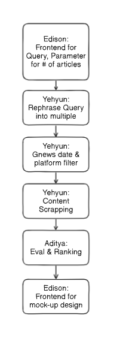
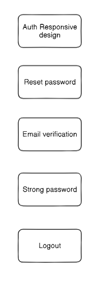
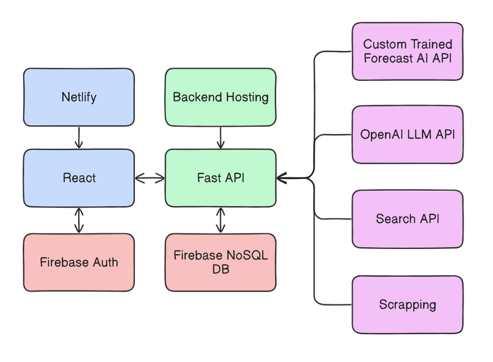

## Summary of the product

The problem this project aims to solve is the complexity of gathering vast, real-time global data and detecting cognitive biases in AI-generated forecasts. Accurate forecasting relies heavily on comprehensive, up-to-date datasets, but current models can be hindered by biased or incomplete data, leading to skewed predictions. The project addresses these challenges by automating the data collection process from multiple sources like news and social media, structuring the data for AI analysis, and visualizing both the forecast and the associated biases. This approach not only improves the transparency of AI forecasts but also helps researchers refine their models to be more accurate and reliable by mitigating biases.

The project is being developed in partnership with the Machine Learning Group at the University of Toronto’s Department of Computer Science. They have developed a large language model (LLM) specifically for forecasting significant future events. Our platform enhances their work by visualizing the LLM’s outputs and providing interactive visualizations that show how biases in the data and the AI’s reasoning may affect the forecasts. The collaboration seeks to make AI forecasting more transparent and collaborative, enabling both researchers and general users to interpret AI predictions with a clear understanding of underlying biases. 

For example, users can ask the platform questions such as "Will Kamala Harris win the 2024 election?" The system will then gather relevant global data, validate it, and use it to generate AI forecasts. The results will be displayed in a way that highlights both the statistics/characteristics of the collected global data and its potential cognitive biases, as well as the AI's reasoning in producing a forecast probability on the input question. This will allow users to gain key insights into the end-to-end AI forecasting process and the biases associated with it.

## How we divided up work

We concluded that the web app mostly comes down to 4 components. Authentication, saving/loading chat history, 2 backend components: collecting information related to forecasting questions and visualizing the forecasting LLM output. In the scope of D2, we decided to focus on the first 3 and work on the visualization part after D2. I (Yehyun) , as a coordinator, decided to divide the team based on the skill sets of each member. For example, Aditya was a bit more backend oriented so I decided to put him in the U2 team. For each sub team, I made a simple flow chart diagram illustrating the logic of each user story and what to implement. For instance, as shown in the diagram below, for U1, the major focus was to plan and define a NoSQL schema, permission setup, and front-end component of the left sidebar to load chat history dynamically. For U2, major logic breaks down into breaking the forecasting question into multiple source relevant queries, collecting news links, collecting news content text, media, and evals, ranking. For U3, focus shifted from chat sharing via link feature to mainly on authentication related features.

 
    
    
    

***Left represents U1, middle U2, last diagram for U3**

Connection between loading chat with sidebar in U1, prompting bar in U2 with the backend, and authentication all adds up for good ground work for us to implement the visualization part after D2.

Below diagram represents the whole stack infrastructure, how each component calls each other. Blue represents frontend, green for backend, where pink is more specific detail of backend components.

 
Upon finishing D1, I already began implementing bare bone authentication, so we already had a clear understanding of what stack we are using, deployment, and libraries. After dividing the team into 3 and assigning user story to each team based on skill sets and interests, it was up to each sub team member to decide what they specifically wanted to work on within their assigned user story scope.

## Sub-team Work

#### 14.1 Subteam:

Our team was primarily responsible for implementing User Story 1, which involved enabling forecast researchers to view and manage all their chat messages with the AI agent. We designed and developed a responsive user interface with a dynamic sidebar that allows users to browse, select, and retrieve chat histories. We used a NoSQL cloud database called Firestore for real-time data synchronization, creating a schema that efficiently stores chat sessions and updates automatically. Each chat session is organized under a user's document in Firestore, featuring fields like user_id, title, messages, created_at, and updated_at to support  chat sorting and retrieval. The dynamic sidebar updates in real-time, reflecting changes in chat activity and ensuring seamless user interaction. Additionally, we implemented Firestore security rules to ensure users could only access their own data, and we handled user login/signup integration to store user information securely in the database. This setup allowed for the smooth management of chats and user data across the application. Lastly, we developed front end unit tests to ensure that our sidebar and chat window worked as intended.

#### 14.2 Subteam:

Our team was primarily responsible for implementing User Story 2, which enabled forecast researchers to prompt questions and get relevant source data that we can feed into our partner’s custom forecasting LLM. This comes down to breaking the forecasting question into multiple source relevant queries, collecting news links considering the filtering options user specified, collecting news content text, media, and evals, ranking to get the most relevant news data that we can feed into the LLM. Partner’s main focus was on accuracy and performance of forecasting, thus we needed multiple steps of validation to get the best quality of news. This is a major difficult part of the web app, following with visualization work we will be doing after D2. User filtering options include choosing the start/end date of source, how many articles to collect for ranking, how many articles do we want after ranking filter, percentage of sources, e.g., 20% Twitter, 10% Facebook, and 70% general. U2’s frontend component was to make prompt bars working with query options, making backend calls, making fronten

#### 14.3 Subteam:

We were originally tasked with implementing a chat-sharing feature that would allow users to share read-only chat sessions via a shareable link. However, during development, we encountered some prerequisites that needed to be addressed first, such as setting up the database and integrating user accounts into the platform. We pivoted our focus toward building a fully functional login system with robust email and password validation. For this system, we required users to verify their email addresses before accessing the platform. Additionally, we implemented password strength validation to ensure users set secure passwords. We also enforced that unverified users or those attempting to sign up with weak passwords would be denied access. To improve user experience, we incorporated a password reset feature for users who forgot their passwords. This functionality included password strength checks when setting a new password. We also developed the core pages, including a sign-up page, a "Learn More" page, and password reset/request password reset pages, with responsive design in mind. We ensured that when users clicked a password reset link sent via email, they were redirected to the appropriate reset page and their account was updated with the new password. We also ensured that users could not access the reset password page without the emailed reset link, and the user would be redirected to the login page upon clicking on the verify link.  Lastly, we created automated tests to verify key aspects of the system, such as ensuring buttons redirected users to the correct pages, and that error messages were displayed appropriately. For example, the system would prompt users to strengthen their password if it was too weak or notify them if they entered an incorrect password.