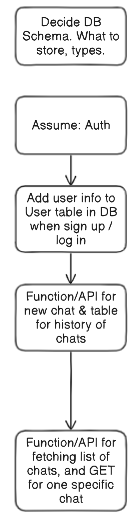
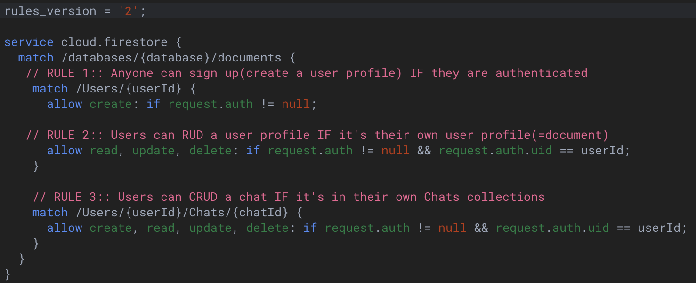
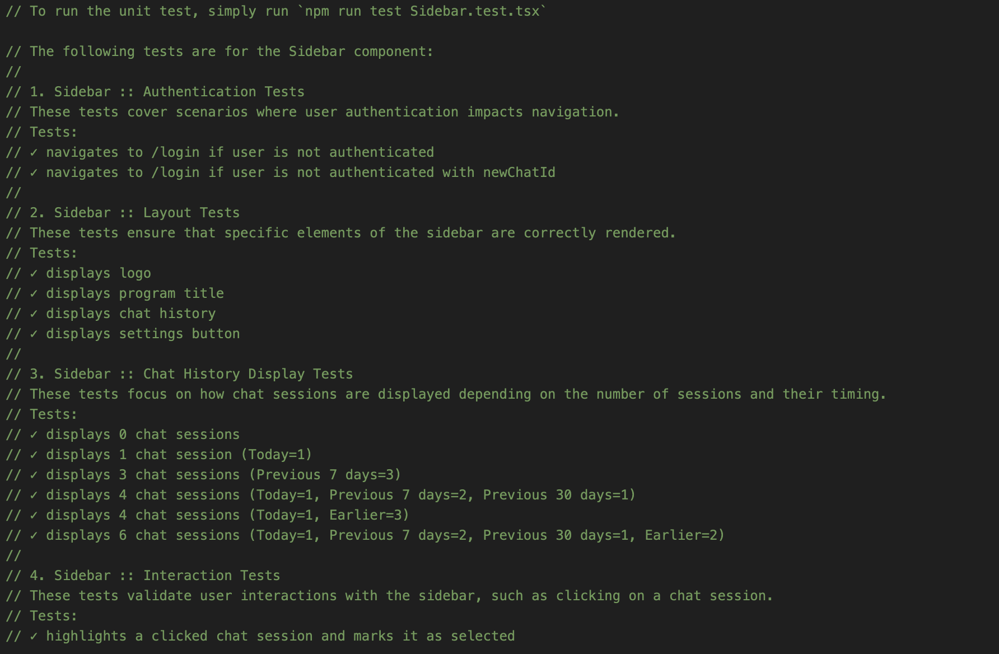
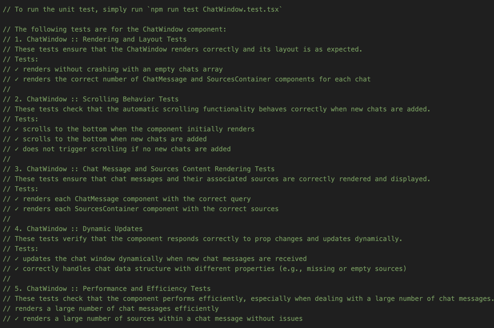
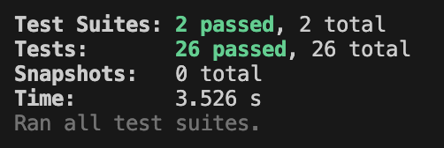
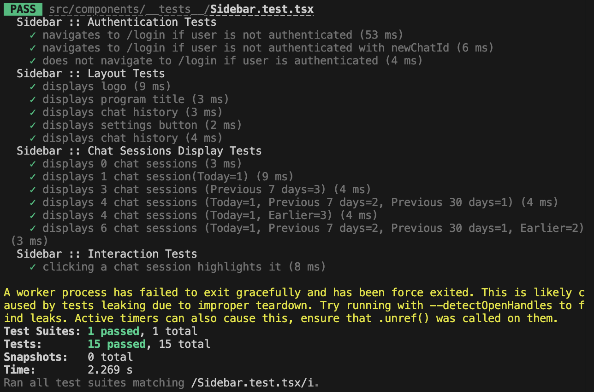
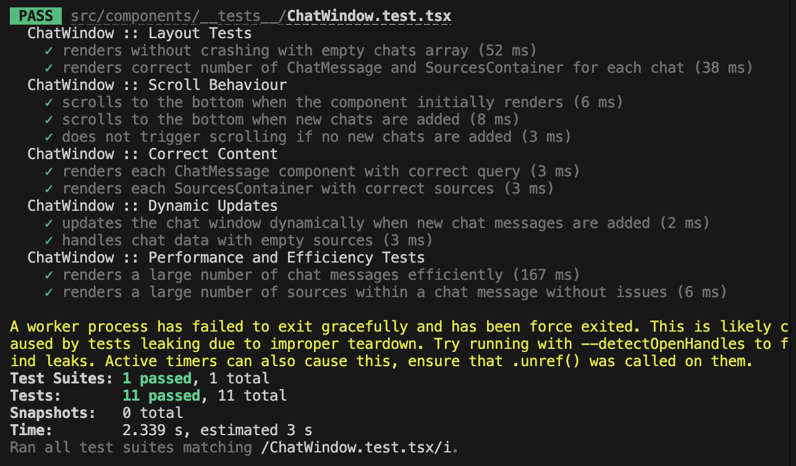

# Subteam Report
ForecastAI/HeavyLifters/Subteam14.1 

## Table of Contents
- [Summary](#summary)
  - [Goal and Focus: User Story 1](#goal-and-focus-user-story-1)
  - [Flow Diagram Drawn by Yehyun Lee](#flow-diagram-drawn-by-yehyun-lee)
- [Database Schema and Rules](#database-schema-and-rules)
  - [Structure](#structure)
  - [Database Breakdown](#database-breakdown)
  - [Data Relationships](#data-relationships)
  - [Security Rules](#security-rules)
- [Key Features](#key-features)
  - [Dynamic Signup/Login](#dynamic-signuplogin)
  - [Dynamic Sidebar](#dynamic-sidebar)
  - [Dynamic Chat Window](#dynamic-chat-window)
- [Implementations](#implementations)
  - [Key Components](#key-components)
  - [Unit Testing](#unit-testing)
- [Individual Contributions](#individual-contributions)
  - [Muaj](#muaj)
  - [Irene](#irene)
- [Instructions](#instructions)
  - [How to Run the Unit Tests](#how-to-run-the-unit-tests)
- [Demonstrations](#demonstrations)
- [Scope of Contribution and Acknowledgment of Team Work](#scope-of-contribution-and-acknowledgment-of-team-work)
- [Deployment](#deployment)


## Summary
### Goal and Focus: User Story 1

Our primary objective was to implement **User Story 1**:  
  ***"As a forecast researcher, I want to be able to view all my chat messages with the AI agent so that I can go back and use it as reference material for future work."***

The main goal was to provide users with a streamlined and intuitive way to view and manage their past chat interactions with the AI agent. This was achieved through a **dynamic and responsive user interface**, particularly a sidebar that allows users to browse, select, and retrieve chat histories efficiently.

#### Flow Diagram Drawn by Yehyun Lee

Here is the flow diagram that Yehyun Lee from Subteam 14.2 created to illustrate the user flow for User Story 1:

  

<br />

---

### Database Schema and Rules

The **database schema** was structured to support dynamic chat functionality while ensuring efficient storage and real-time updates of chat sessions. The key features included chat history tracking and automatic sorting based on the latest modifications. We implemented real-time synchronization to ensure seamless data consistency across sessions, enabling smooth transitions between chats and immediate reflection of any changes made by users.

#### Structure
We utilized **Firestore**, a NoSQL cloud database, chosen for its flexibility and real-time synchronization capabilities—key to supporting dynamic chat functionality. Firestore's ability to store collections of documents without rigid schemas allows us to scale as needed while meeting the project's query and scalability requirements.

#### Database Breakdown

- **Users Collection**  
  The **Users** collection stores essential information for each user. Each document within the collection includes a unique `user_id` (UID), derived from Firebase Authentication, and basic fields like `email`.

- **Chats Subcollection**  
  Under each user document, there exists a **Chats** subcollection that manages all chat sessions between the user and the AI agent. Each chat is stored as a document containing essential fields such as:
  - `user_id`: Links the chat to the user.
  - `title`: Automatically generated from the first message, but editable by the user.
  - `messages`: An array that stores each message object, including the sender, content, and timestamp.
  - `created_at`: The timestamp for when the chat session was created (used for sorting and filtering).
  - `updated_at`: The timestamp of the last activity in the chat.

#### Data Relationships

We adopted an **embedding approach** to maintain efficient querying, especially for fetching a user’s chat history. The **One-to-Many** relationship between users and their chat sessions allows easy retrieval of chat data by querying the subcollection under each user document. This structure ensures that all relevant chat data can be fetched quickly and efficiently when the user logs in.

#### Security Rules

To safeguard user privacy and data integrity, we implemented strict **security rules**, ensuring that users can only access their own data and preventing unauthorized access to other users' chats.


Below is a snippet of the implemented security rules:

  

---

### Key Features

#### Dynamic Signup/Login

Upon successful signup or login, the database is automatically updated to store the user’s information in the **Users collection**. This ensures seamless user management for later chat functionalities and ensures that users—regardless of their email type—are correctly added to the database.

#### Dynamic Sidebar

The **dynamic sidebar** is now fully integrated with the database. It allows users to either select existing chats or initiate new ones. By default, no chat is selected. 

Users can simply click on a chat to view its messages, or they can create a new chat by not clicking or re-clicking the selected chat.  Upon creating a new chat, the title is automatically set with the first message serving as the default title. 

The sidebar provides real-time updates, immediately reflecting new messages and auto-sorting chats based on the most recent activity. This enhances the user experience by ensuring the most relevant conversations are easily accessible without requiring manual refreshes.

#### Dynamic Chat Window

The **dynamic chat window** operates seamlessly for both new and returning users, providing a smooth and intuitive flow. All messages are stored in the database and displayed in the chat window synchronously. Users can start new conversations or revisit old ones, with real-time updates ensuring that the chat window displays only relevant messages for the selected session. This facilitates easy message additions and history retrieval without interruptions.


### Implementations

As the key features are tightly integrated, we have worked on more than the following components. However, the following components are the main implementations for the key features:

#### Key Components
The main implementations of the components for the key features can be found in the following files:
- `Sidebar.tsx`: 
  - Manages the dynamic sidebar interactions, including chat selection, creation, and real-time updates. The full path from the project root is `forecast-ai/frontend/src/components/Sidebar.tsx`.
- `ChatWindow.tsx`: 
  - Handles the dynamic chat window functionality, displaying messages in real-time and ensuring that the chat history is accurately reflected based on user selections. 
  - The full path from the project root is `forecast-ai/frontend/src/components/ChatWindow.tsx`.
- `types.ts`:
  - Contains the type definitions for the chat data structure, ensuring consistency and reliability across components.
  - The full path from the project root is `forecast-ai/frontend/src/components/hooks/types.ts`.
- `saveChat/`: 
  - Contains the functions for saving chat data to the database, ensuring that all chat sessions are stored accurately and efficiently. 
  - The directory includes `_saveAISourcesMessages.tsx`, `_saveUserMessages.tsx`, `useGetChatRef.tsx`, and `useSaveChat.tsx`. 
  - Each file contributes to saving chat data from AI, users, getting chat references, and managing chat saving hooks.
  - The full path from the project root is `forecast-ai/frontend/src/components/hooks/saveChat/`.
- `getChatMessages.tsx`:
  - Contains the function for retrieving chat messages from the database, ensuring that users can access their chat history more seamlessly especially for the future work.
  -  The full path from the project root is `forecast-ai/frontend/src/components/hooks/getChatMessages.tsx`.

#### Unit Testing

We conducted thorough **unit testing** for the core components of the chat functionality, ensuring reliability and performance:
- Tests are saved in the `forecast-ai/frontend/src/components/__test__/` folder. They are named `Sidebar.test.tsx` and `ChatWindow.test.tsx`.
- Continuous progress updates were provided to the team regarding database connection successes and overall feature integration.
- The comments at the top of each test file provide a clear overview of the test suite's purpose and descriptions of the test cases. Below are the screenshots of the comments:

  **Sidebar Unit Testing Comments**
    

  **ChatWindow Unit Testing Comments**
    

- Refer to the instructions(#how-to-run-the-unit-tests) below for running the unit tests.

---

# Individual Contributions
## Muaj
Muaj’s main role was developing a comprehensive database schema that the team could follow to meet their goals. The schema contained significant information about how user data should be stored. More specifically, the schema was foundational for handling chat data, as it allows the app to store each user's chat history in a way that makes it easy to access and manage, facilitating features that were/will be implemented like search, sorting, and retrieval of chat messages for viewing purposes. This organized structure not only simplified backend processes but also served as the main guide for all the teams to follow when making their components. As such, the schema played a critical role for our application. Muaj was also responsible for implementing the updating of the database with user information upon successful login/signup with google or other email types. He also fully wrote the README for the project, providing detailed instructions and descriptions. This README served as a critical resource for other team members and future developers, offering clear guidance on how to set up, use, and contribute to the project.

## Irene
Irene contributed to updating the database schema and rules, but her main focus wat to implement dynamic sidebar interactions chat window functionality. She implemented key features, including allowing users to select or create new chats from the sidebar, setting the default title for new chats as the first query, and ensuring chat history is maintained based on user selections. Irene integrated real-time message updates, saving them to the correct chat session and reflecting changes in the sidebar. She addressed bugs related to real-time updates and user account behaviors, ensuring smooth navigation and sorting of chats by the latest activity. She wrote unit tests for both the **Sidebar** and **ChatWindow** and collaborated with sub-teams U2 and U3 to align on chat rules and type definitions, continuously revising the codebase to maintain team coordination. She also implemented the logout functionality, ensuring that users could securely log out of their accounts and clear their corresponding session data. She designed the UI for the query options when D2 has been started using Figma, ensuring that the team had a clear vision of the final product. Here is a video of the Figma design:


  <video controls="controls" style="max-width: 600px;" src="https://github.com/user-attachments/assets/f1230773-ec8c-4766-a05d-066d1c86d19b">
  </video>

# Instructions
## How to Run the Unit Tests
1. Navigate to the project directory. (e.g., `cd forecastAI/frontend`)

2. Run the following command to install the necessary dependencies:
   ```
   npm install
   ```

3. Run the following command to execute all the unit tests:
   ```
   npm test *
   ```
    You should see the test results displayed in the terminal as shown below:

      


4. Alternatively, you can run the tests for the `Sidebar` or `ChatWindow` components individually:
   ```
   npm test Sidebar.test.tsx
   npm test ChatWindow.test.tsx
   ```

    You should see the test results displayed in the terminal as shown below:

    - **Sidebar Unit Testing Output**

      

    - **ChatWindow Unit Testing Output**
  
      
   
5. Quit the test runner by pressing `q` after the tests have completed.
  Below is a video that demonstrates how to run the unit tests:

    <video controls="controls" style="max-width: 600px;" src="https://github.com/user-attachments/assets/e1b6b343-35a9-4c87-b292-14a60780543a">
    </video>

# Demonstrations
Here are some videos that demonstrate the features implemented by our subteam:

1. **General Overview of Dynamic Sidebar and Chat Window Interaction**
   
   This video showcases the dynamic sidebar and chat window interactions, allowing users to select or create new chats, update existing chats, and view real-time message updates.
   <video controls="controls" style="max-width: 600px;" src="https://github.com/user-attachments/assets/3b4cbc31-b802-4060-a998-d9a2702e7605">
   </video>

2. **Automated Chat Title Generation**
   
   This video demonstrates the automated chat title generation feature, which assigns a meaningful title to each chat session based on the first message.
   <video controls="controls" style="max-width: 600px;" src="auto-default-title.mov"> 
  </video>

3. **Automated Sorting of Chats**
   
   This video showcases the automated sorting of chats based on the latest activity, ensuring that the most recent conversations are easily accessible.
   <video controls="controls" style="max-width: 600px;" src="auto-sort-chats.mov"> 
  </video>

4. **Database Stores Existing Chat History**
   
   This video demonstrates that the database stores existing chat history for the user correctly, ensuring that users can access their chat sessions seamlessly.
   <video controls="controls" style="max-width: 600px;" src="DB-stores-existing-chat-history.mov"> 
  </video>

5. **Existing Account Creates a New Chat**
   
   This video showcases the process of creating a new chat session by unselecting a chat, including setting the default title and updating the sidebar with the new chat.
   <video controls="controls" style="max-width: 600px;" src="./images/14.1/how-to-start-new-chat.mov"> 
  </video>

6. **New Account Creates a New Chat and Continues from There**
   
   When a new user logs in, they can create a new chat by simply inputting their very first message.
   This video demonstrates the default behavior when creating a new chat, allowing users to continue from the newly created chat without any additional steps.
   <video controls="controls" style="max-width: 600px;" src="./images/14.1/new-account-create-new-chat-then-continue-from-there.mov"> 
  </video>

7. **Real-Time DB Updates and Chat Reflection**
   
   This video demonstrates the real-time updates of the database and chat reflection, ensuring that changes made by users are immediately reflected in the chat window. Also note that the chat sessions are sorted based on the latest activity in real-time.
   <video controls="controls" style="max-width: 600px;" src="./images/14.1/saves-chat-message-correctly-to-session.mov">
  </video>


# Scope of Contribution and Acknowledgment of Team Work
In this project, our team divided the work into 3 subteams. This subteam's (14.1) contributions  focused on updating the database, the chat history feature, and enabling users to interact with their chat sessions. We implemented the UI that allows users to view, select, and engage with past chats, along with features like automated chat title generation and editing for better organization. 

Please note that the data that will be displayed after a user submits a question will be placeholder (dummy) data that we manually input for demonstration purposes. This means the response will remain the same regardless of the user's input. The actual backend, which will provide dynamic, accurate responses, has been developed by another Subteam (14.2) as part of their component.

It's important to acknowledge that while we handled the chat interaction, database update, and history functionality, there were certain features we did not work on. Those include authentication, the prompt bar, and any other sort of backend development. We merged these features from team 14.2 because some of our work depended on their work (ex. prompt bar).

Also note that the flow diagram above was created by Yehyun Lee from Subteam 14.2, as mentioned in the summary.

# Deployment
Our deployed application link: https://forecastai.netlify.app/login 

Test account that can be used without signing up:
- Email: edisonliem417@gmail.com
- Password: forecastai1234

Enjoy forecastAI!
