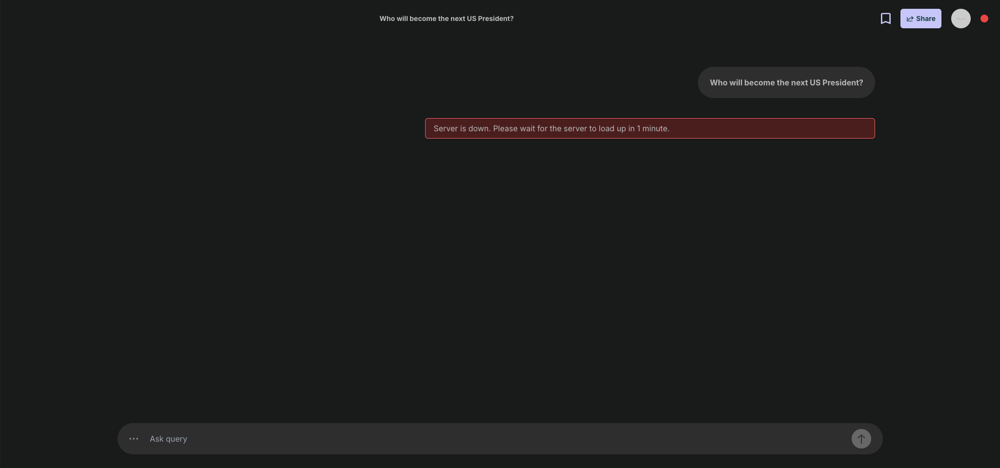
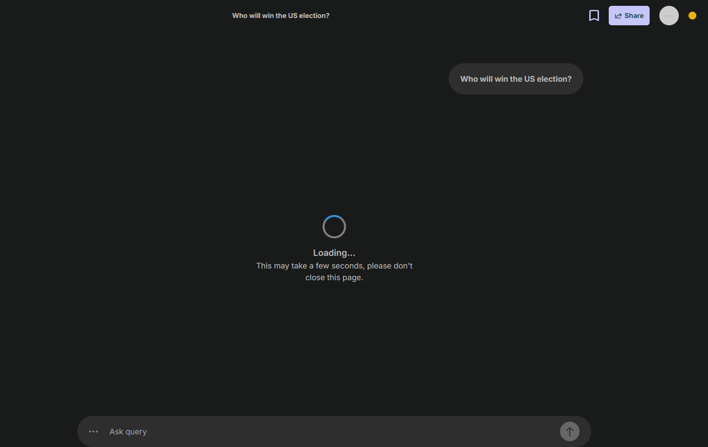
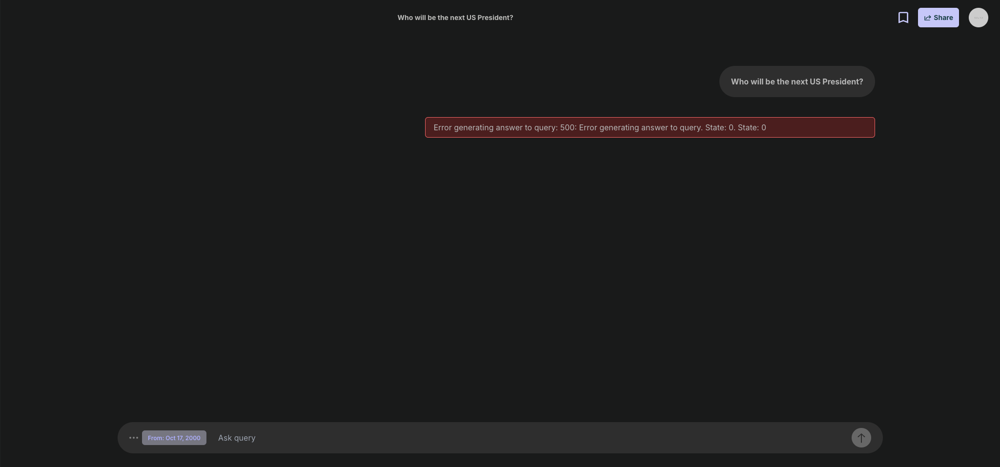
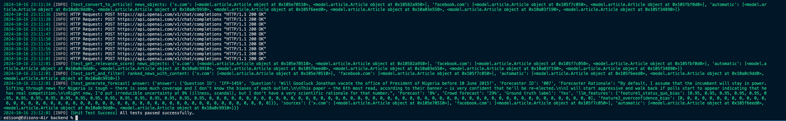
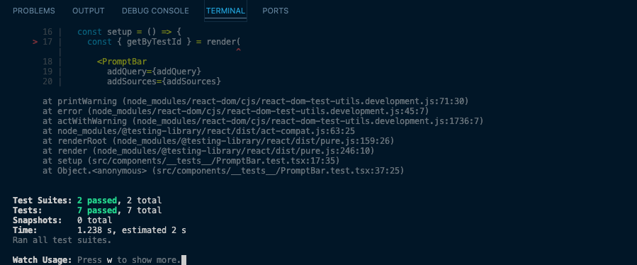

## User Story 💬

"As a forecast researcher, I want to be able to see the 10 most relevant data related to the forecasting question that I have inputted so that I can view all the related sources that feed to the AI forecasting model. Users can control the parameters of how much data is needed."

Acceptance Criteria ✅

- The system must allow users to input a specific forecasting question. 
- The system must retrieve and display the 10 (or X amount) most relevant data points related to the forecasting question inputted by the user. 
- Users should be able to view the entire content of each data source to understand its context.

For the frontend, prompt bar at the bottom of the page where you can type. When entered, output of the user's text will be shown in the page. Additionally, system output relevant data which will be used for LLM as a mock-up design. This team is focused on heavy backend logic, so we paid less attention to the design, but the functionality.

Flow Diagram:

 

**Input**: Input question, # of search queries, # of articles to collect before ranking, # of articles to display after ranking, % of sources for articles before and after ranking (ex. 10% twitter), start/end date

**Example**:
Will Elon Musk be the richest person in the world on December 31, 2025?
- Richest man December 31, 2025
- Elon Musk net worth

## Summary of Decisions and Options

#### Tasks
### Backend

- API for breaking down forecast question into searchable queries:
    - To collect relevant articles to feed into LLM, we need to break the forecasting question into sub queries. Each subquery must be specific to sources users choose based on percentage. We decided to let users choose the percentage of sources, instead of an explicit number. For instance, given # of articles to collect before ranking is 10, 20% of Twitter sources, 2 Twitter query will be generated and the other 80% will be generic query, unless specified for other sources.

- API for collecting Gnews data & performing date and platform filter:
    - Given a custom query per source, we will use the query along with the filtering of source, start/end date, location, language to collect news links. Gnews offers a feature for collecting news links with filters. It gives the published date and link, but does not return any content.
    - For choosing the best search API for collecting news, we have compiled our research and testing in this doc: [Search API Comparison](https://docs.google.com/document/d/124NxmlysbmbfZ46NWT1eaZaIa00Cz_VfYLnSXimMyec/edit?tab=t.0)

- Content Scraping
    - When it comes down to content scraping, it breaks down to 3. Simple beautifulsoup HTML scraping, advanced selenium JS scraping, and ScraperAPI. First two have been implemented, where selenium is disabled in the production website. Before working on enabling selenium on our hosting with Docker, we’re looking into ScraperAPI, which our partner has recommended recently.
    - Locally, content scrape works the following: it uses simple beautifulsoup HTML scraping, once failed where content is empty, uses selenium to scrape. This enables us to scrape Twitter, or Facebook. We still can’t scrape paywalled websites though.
    - In production, selenium isn’t hosted due to lack of Docker, so for now, it only uses simple beautifulsoup scraping.
    - We’re looking to replace our selenium with ScraperAPI, or simply stick to selenium and improve speed of scraping by threading.

- API for evaluating and ranking news articles:
    - Compute relevance score for each article
        - LLM rates relevance of articles (summary/full body) wrt original forecasting question
        - NLP metric-based cosine similarity/BLEU relevance score of article title wrt extracted search query
        - BLEU is very simple and directly compares n-grams in sentence with reference, so directly compares sentences word for word (may not understand context/synonyms in titles)
        - Cosine similarity compares vector representations of texts, but still primarily based on frequency/occurrence of words depending on vector representation (i.e. TF-IDF, word counts); or semantics using word embeddings which capture context, meaning, etc.
    - Sort and return N most relevant articles (with highest relevance score)

### Frontend

- Input Forecast Question Functionality:
    - Create a prompt bar where user can input a forecast question to produce a forecast probability from the AI system
    - Provide an advanced query options menu for users to toggle different parameters including number of articles to collect, number of articles to display, news ratio, X ratio, facebook ratio, start date and end date.
    - Used react-datepicker library to create a calendar for start date and end date of articles due to the following reasons:
        - Good design that can easily be configured to match our system
        - Easy to integrate to our system as a standalone component
        - Lots of different options to configure to make the component as customizable as possible

- Display Visualizations of Processed Data
    - Display the question users have provided
    - Display the X most relevant news articles related to the forecasting question inputted by the user.
    - Users should be able to view the entire content of each data source to understand its context.
    - Users can travel between articles collected with left and right arrows.

- Interactive Chat Window Functionality
    - Build a chat window which shows user’s all forecast questions’ responses in the current session
    - Build a header bar which shows the theme of the current session and allows user to export link to this session

## Individual Contributions

**Yehyun Lee:**

I worked on hosting frontend and backend with Netlify and Render with CI/CD from our forked repo. Setting initial firebase infrastructure and bare bone authentication with custom email and Google account login/signup features with no UI/UX design, which I then handed over to the U1/U3 team for the majority of firebase/auth design improvement, i.e. design, reset password, email verification. I then pivot to focus on the backend where I worked on dynamic query breakdown per sources, LLM structured output verification, collecting news links with filtering options using Gnews, simple HTML text/media scraping with beautifulsoup, advanced selenium JS scraping, fixing ranking function, general backend flow, all the backend unit testing, and deployment hotfixes for frontend and backend after the team merged sub team branches. Coming back to frontend, I added server status in the header and the logic in the prompt bar to ensure the user is aware of server load up time and better error handling messages. Not shown in git, but requested by our partners, I conducted research and testing of Gnews, SerperAPI and ScraperAPI, which can be viewed here: [doc](https://docs.google.com/document/d/124NxmlysbmbfZ46NWT1eaZaIa00Cz_VfYLnSXimMyec/edit?usp=sharing). Lastly, holding weekly meetings with our partner and the team, managing the team, instructing, and quite fast communication!

**Ho Kwan Edison Liem:**

Before working on the actual user story, I conducted thorough research and testing on various Search APIs such as Gnews, NewsData.io, and Google Custom Search JSON API, which I summarized in this document [Search API Comparison](https://docs.google.com/document/d/124NxmlysbmbfZ46NWT1eaZaIa00Cz_VfYLnSXimMyec/edit?usp=sharing). During user story 2, I focused primarily on the frontend of the application, building a chat window that allows users to view their chat history and input forecasting questions via a prompt bar. I implemented several key features, including a header bar to display the chat's theme, dynamic content updates based on user input, automatic scrolling for new chats, and the ability to swap different sources for improved readability. Additionally, I implemented an advanced query options menu, allowing users to specify parameters like total articles to collect/display, news/x/facebook ratios, and article date ranges when fetching sources from the backend. I have added loading indicators while awaiting backend responses, error messages for backend issues, and built frontend unit tests including SourcesContainer.test.tsx and Promptbar.test.tsx. I also connected the frontend prompt bar to the backend server and helped with developing the bare-bone feature of breaking down forecasting questions into searchable queries and API Request model. Finally, I helped the team merge U1 and U2 into the main branch.

**Aditya Ohri:**

I conducted a thorough literature review supported by in-depth discussion with our partner to evaluate different methods to compute relevance scores for an article with respect to the original forecasting question, in order to get the top N most relevant articles. This included analyzing classical similarity scoring methods like BLEU and cosine similarity with different types of embedding vectors to represent the text, as well as newer methods involving language models. After a review and running experiments, I decided to proceed with implementing the language model method as it performed most optimally at assessing relevance due to a comprehensive understanding of the topic of a text and the original forecasting question. I designed and implemented functions to compute a relevance score for each scraped article with the OpenAI API, and sort and filter the top N articles from each source. I also implemented key infrastructure in the backend including an Article class to represent collected data internally in a clean, structured way for ease of development. As well, I refactored the backend pipeline accordingly with clean functional steps, and contributed to documentation, meetings, and key team discussions related to development decisions.

## Work Verification/Evidence; Unit Test

Locally, content scraping works by using simple BeautifulSoup HTML scraping, with Selenium as a fallback if content is empty, which allows us to scrape sites like Twitter or Facebook. However, we still can't scrape paywalled websites. In production, Selenium isn't hosted due to the lack of Docker support, so it only uses BeautifulSoup scraping for now. We're considering replacing Selenium with ScraperAPI or sticking to Selenium while improving scraping speed by using threading. As a result, in the current production setup, it's normal for sources to have no text content when they are fetched and displayed in the frontend chat window.

Currently, in the backend, response times may take around 1-3 minutes due to the heavy workload involved in collecting news through Gnews and scraping content with Selenium. As a result, it is completely normal to take a longer response time for it to display content in the frontend. We are planning to improve it using several approaches after D2.

Either running frontend locally with backend running locally or with production backend; or fully remote production web app at https://forecastai.netlify.app, you can use our web app. You can type in questions, set query options, click the button to submit (enter is not supported yet), wait a minute for content that’s going to be fed to LLM show up, and you can swipe different contents. In production web, since advanced selenium scraping is off, the majority of content (mostly from Twitter or Facebook) will be empty. When running locally, with `REACT_APP_BACKEND_URL` set to local, more content will show up. Please follow our instructions to test.

Expected user flow in user story 2 (local):

<video src="https://github.com/user-attachments/assets/6bed3b01-1f62-4c9b-9eb3-709871057002" controls="controls" style="max-width: 730px;">
</video>

 

Expected user flow in user story 2 (production):

<video src="https://github.com/user-attachments/assets/03b27fe0-6d79-4e8a-ac3c-4e23a69a2b06" controls="controls" style="max-width: 730px;">
</video>

 

For backend deployment, we have used a serverless option, so if the server remains inactive for over 15 minutes, it automatically spins down. When a user submits a forecasting question while the server is down, it takes approximately 1 minute to restart the server. During this time, the frontend will display an error message: "Server is down. Please wait for the server to load up in 1 minute." Users should wait about 1 minute before continuing the process, as the system will resume once the server is fully loaded.

 
When the server is loading up, the status bar will be yellow. We suggest prompting questions only when the status is green.

 
There may be instances when an error occurs, and an error response is returned to the frontend:

 

### Local Backend Testing

1. Git clone the D2-14.2 branch
2. Go to forecast-ai/backend folder and download all python packages in requirements.txt by `pip install -r "requirements.txt"`.
3. Create a .env file at the root of forecast-ai/backend folder with credentials emailed. Example outline is in .env.example. Set the `LOCAL_OR_PROD`= to either local or prod. If you want to enable advanced selenium scraping, feel free to set it as local.
4. Run the unit_test/unit_test.py with python unit_test/unit_test.py.
5. Results should look like the following picture:

 

### Local Frontend Unit Testing

1. Git clone the D2-14.2 branch
2. Go to forecast-ai/frontend folder and install all the necessary libraries in package.json by `npm install`.
3. Create a .env file at the root of forecast-ai/frontend folder with credentials emailed. Example outline is in .env.example. Set the `REACT_APP_BACKEND_URL`= to either http://localhost:8000 for local or the prod backend url that we have included in the credentials email for prod. **Ensure no additional “/” is added.**
4. Inside forecast-ai/frontend folder, run `npm test` to run all the frontend unit tests locally.
5. Results should look like the following picture:

 

## Deployed Application

Our deployed application link: [forecastai.netlify.app](https://forecastai.netlify.app/)

For automated deployment, we utilize CI/CD by maintaining a private fork of our project in a personal GitHub account. Whenever updates are made to the main branch, syncing the fork in the private fork triggers the CI/CD pipeline, which redeploys the frontend and backend application with the latest commits.

<video src="https://github.com/user-attachments/assets/03b27fe0-6d79-4e8a-ac3c-4e23a69a2b06" controls="controls" style="max-width: 730px;">
</video>

 

Test account that can be used without signing up:
- Email: edisonliem417@gmail.com
- Password: forecastai1234